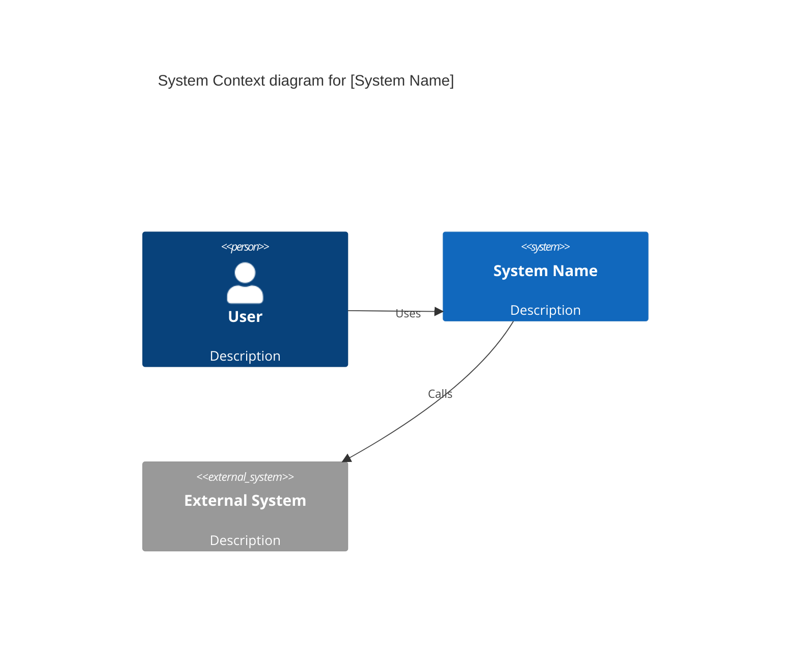
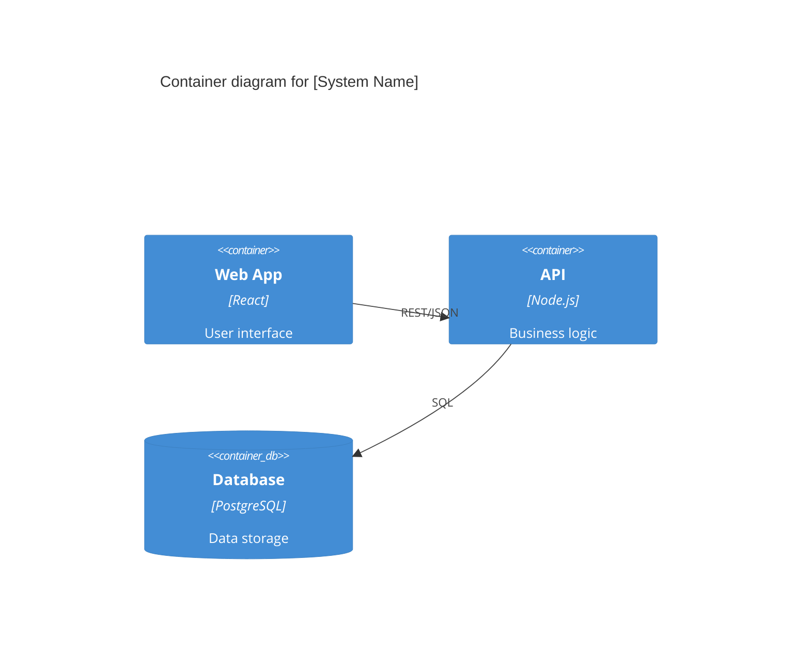
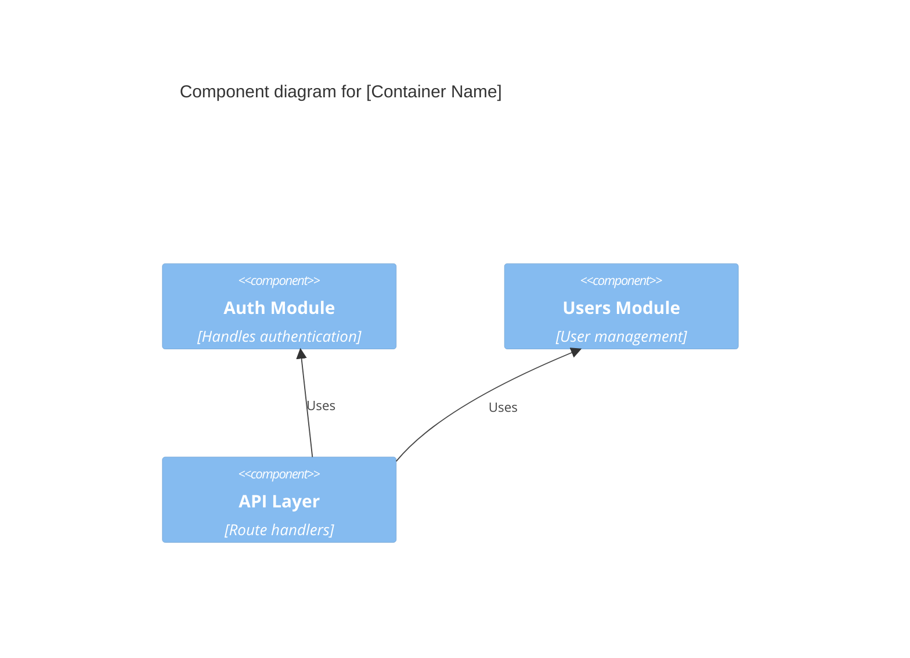
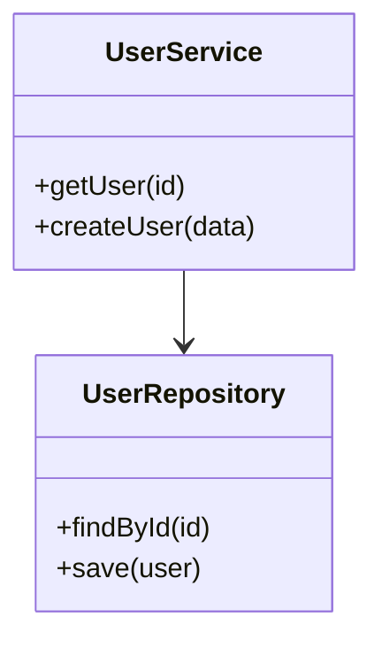

# C4 Architecture Mapping

Map the codebase architecture using the C4 model (Context, Container, Component, Code).

## Instructions

Use the Task tool to spawn 4 parallel Explore agents. Each agent analyzes one C4 level. Run all 4 in a single message for parallel execution.

### Agent 1: System Context

```
Explore the codebase to map the SYSTEM CONTEXT level:

1. Identify the system boundary - what is this software system?
2. List all users/actors who interact with the system
3. Map external systems:
   - Third-party APIs and services
   - External databases
   - Authentication providers
   - Payment systems
   - Email/notification services
4. Document data flows in and out of the system

Return a Mermaid C4Context diagram:


Also return: list of external integrations found with file paths.
```

### Agent 2: Container Level

```
Explore the codebase to map the CONTAINER level:

1. Identify all deployable units:
   - Frontend applications (web, mobile)
   - Backend services/APIs
   - Background workers/jobs
   - Databases (type and purpose)
   - Message queues
   - Cache layers
2. Document technology stack per container (check package.json, requirements.txt, Dockerfile, etc.)
3. Map inter-container communication:
   - REST/GraphQL APIs
   - gRPC
   - Message queues
   - Shared databases
4. Identify entry points and protocols

Return a Mermaid C4Container diagram:


Also return: technology stack summary and key configuration files found.
```

### Agent 3: Component Level

```
Explore the codebase to map the COMPONENT level:

For each container identified, analyze:
1. Major modules/packages (top-level directories under src/)
2. Component responsibilities (one sentence each)
3. Internal dependencies between components
4. Key interfaces/contracts between components
5. Shared utilities and their consumers

Return Mermaid C4Component diagrams (one per container):


Also return: module dependency list and interface files found.
```

### Agent 4: Code Level

```
Explore the codebase to map the CODE level:

For key components identified, analyze:
1. Key classes/modules and their purposes
2. Design patterns in use (Repository, Factory, Observer, etc.)
3. Class relationships and hierarchies
4. Critical code paths (request handling, data processing)
5. Shared base classes or interfaces

Return Mermaid class diagrams for key components:


Also return: list of key classes with file paths and patterns identified.
```

## After All Agents Complete

Create the `codemap/` folder and write each level to a separate file.

### Step 1: Create folder
```bash
mkdir -p codemap
```

### Step 2: Write files

**codemap/README.md**
```markdown
# C4 Architecture Map

<!-- Last updated: YYYY-MM-DD -->

Overview of [Project Name] architecture using the C4 model.

## Contents

- [context.md](./context.md) - System context and external integrations
- [containers.md](./containers.md) - Deployable units and technology stack
- [components.md](./components.md) - Internal modules and dependencies
- [code.md](./code.md) - Key classes and design patterns

## Quick Navigation

| Level | Scope | File |
|-------|-------|------|
| 1 | System Context | context.md |
| 2 | Containers | containers.md |
| 3 | Components | components.md |
| 4 | Code | code.md |

## Technology Stack
[Summary from Agent 2]

## Key Files
[Combined file path list from all agents]
```

**codemap/context.md**
```markdown
# Level 1: System Context

<!-- Last updated: YYYY-MM-DD -->

[Agent 1 output: description]

## Diagram

[Agent 1 Mermaid C4Context diagram]

## External Systems

| System | Type | Integration Point |
|--------|------|-------------------|
| ... | ... | ... |

## Data Flows

[Description of data entering/leaving the system]
```

**codemap/containers.md**
```markdown
# Level 2: Containers

<!-- Last updated: YYYY-MM-DD -->

[Agent 2 output: description]

## Diagram

[Agent 2 Mermaid C4Container diagram]

## Container Details

| Container | Technology | Purpose |
|-----------|------------|---------|
| ... | ... | ... |

## Communication

[Inter-container protocols and patterns]
```

**codemap/components.md**
```markdown
# Level 3: Components

<!-- Last updated: YYYY-MM-DD -->

[Agent 3 output: description]

## Diagrams

[Agent 3 Mermaid C4Component diagrams - one per container]

## Component Responsibilities

| Component | Responsibility |
|-----------|----------------|
| ... | ... |

## Dependencies

[Internal dependency map]
```

**codemap/code.md**
```markdown
# Level 4: Code

<!-- Last updated: YYYY-MM-DD -->

[Agent 4 output: description]

## Class Diagrams

[Agent 4 Mermaid class diagrams]

## Design Patterns

| Pattern | Location | Purpose |
|---------|----------|---------|
| ... | ... | ... |

## Key Classes

| Class | File | Purpose |
|-------|------|---------|
| ... | ... | ... |
```

### Step 3: Confirm output

After writing all files, list the codemap folder:
```bash
ls -la codemap/
```

Output confirmation message with file locations.
